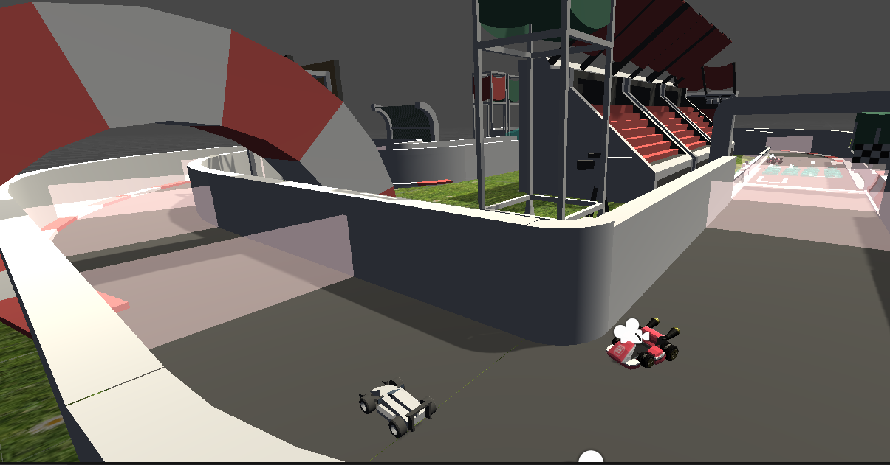
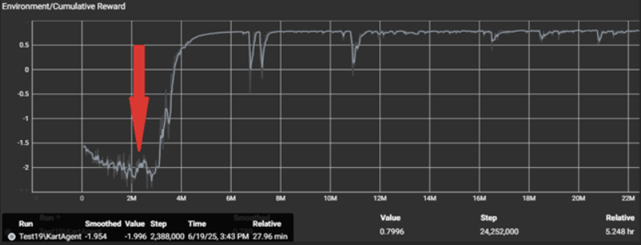

# AI Racing Karts


# Intelligent NPC Racing Game with Unity ML-Agents

> | Unity • C# • Machine Learning • Reinforcement Learning • PPO • ONNX

---

## Overview

This project is a 3D racing game developed in **Unity 2022 LTS**, where AI-controlled opponents learn to drive autonomously using **Reinforcement Learning** instead of traditional scripted behavior or predefined racing lines.

The main objective was to design and train intelligent NPCs capable of navigating a complex racing track, avoiding obstacles, following checkpoints, and competing against a human player using a neural network trained with **Unity ML-Agents**.

The trained model is exported in **ONNX** format and integrated directly into Unity for real-time gameplay.

---

# Project Preview



## Training Environment



# Features

- Intelligent AI opponents powered by Reinforcement Learning
- Human player controller
- Physics-based vehicle movement
- Neural Network decision making
- Multi-agent training environment
- Dynamic checkpoint system
- Reward & penalty learning system
- ONNX model inference
- Camera follow system
- Race management system
- Main menu
- Pause menu
- Restart functionality
- HUD interface

---

# Technologies

## Game Development

- Unity 2022 LTS
- C#
- Unity Physics (PhysX)

## Artificial Intelligence

- Unity ML-Agents
- Reinforcement Learning
- PPO (Proximal Policy Optimization)
- Neural Networks
- ONNX

## Machine Learning

- Python
- PyTorch
- TensorBoard

## Development

- Visual Studio
- Git
- GitHub

---

# AI Architecture

Instead of following predefined racing lines, NPC vehicles learn their driving behavior through Reinforcement Learning.

Each agent continuously observes the environment, predicts the best possible action using a neural network, and improves its behavior through thousands of training episodes.

### Observations

- Current velocity
- Vehicle rotation
- Checkpoint direction
- Distance to next checkpoint
- Raycast obstacle detection
- Current movement direction

### Actions

- Steering
- Acceleration
- Braking

---

# Reinforcement Learning Pipeline

```
Unity Environment
        │
        ▼
 Unity ML-Agents
        │
        ▼
 Python Trainer
        │
        ▼
 PPO Algorithm
        │
        ▼
 Neural Network Training
        │
        ▼
 Export ONNX Model
        │
        ▼
 Unity Runtime
```

---

# Reward System

The AI agent learns through rewards and penalties.

### Rewards

- Passing checkpoints
- Completing laps
- Maintaining forward progress
- Efficient driving

### Penalties

- Collisions
- Driving backwards
- Leaving the track
- Staying idle

This reward structure encourages the AI to discover an optimal racing strategy instead of simply reaching the finish line.

---

# Machine Learning Training

The training process was implemented using Unity ML-Agents and Python.

The neural network was trained using the PPO algorithm while TensorBoard monitored the learning progress.

### Training Features

- Parallel training agents
- Automatic episode reset
- Continuous learning
- Reward optimization
- Hyperparameter tuning

After training, the neural network is exported to the ONNX format and executed directly inside Unity without Python.

---

# Game Architecture

## Player

- WASD Controls
- Rigidbody Physics
- Camera Follow
- Collision Detection

## AI NPC

- Autonomous Driving
- Neural Network Decisions
- Raycast Sensors
- Checkpoint Navigation
- Reward-Based Learning

## Managers

- GameManager
- RaceManager
- SpawnManager
- CheckpointManager
- UIManager

---

# Project Structure

```text
Assets/
│
├── AI/
│   ├── Agents
│   ├── Models
│   ├── Sensors
│
├── Controllers/
│   ├── PlayerController.cs
│   ├── NPCController.cs
│
├── Managers/
│   ├── GameManager.cs
│   ├── RaceManager.cs
│   ├── CheckpointManager.cs
│
├── UI/
│
├── Scenes/
│
├── Prefabs/
│
├── Materials/
│
└── Animations/
```

---

# Technical Challenges

During development several technical problems had to be solved:

- AI reward balancing
- PPO hyperparameter tuning
- Stable vehicle physics
- High-speed cornering
- Obstacle avoidance
- Neural network convergence
- Multi-agent synchronization
- ONNX model integration
- Performance optimization

---

# Skills Demonstrated

## Game Development

- Unity Engine
- C#
- Object-Oriented Programming
- Physics Simulation
- UI Development
- Game Architecture

## Artificial Intelligence

- Reinforcement Learning
- Machine Learning
- Neural Networks
- PPO Algorithm
- Unity ML-Agents
- ONNX Inference
- TensorBoard Analysis

## Software Development

- Git
- GitHub
- Python
- Software Design
- Debugging
- Performance Optimization

---

# Results

The trained NPC successfully learned to:

- Drive autonomously
- Follow racing checkpoints
- Avoid obstacles
- Complete laps without scripted behavior
- Compete against a human player

The final AI model is fully integrated into Unity using ONNX and performs inference in real time.

---

# What I Learned

This project allowed me to gain practical experience in:

- Unity game development
- Artificial Intelligence
- Reinforcement Learning
- Machine Learning workflows
- Neural Network training
- Software architecture
- Performance optimization
- AI integration inside commercial game engines

---

# Future Improvements

- Smarter overtaking strategies
- Dynamic difficulty adjustment
- Multiplayer support
- Different AI personalities
- Improved racing behavior
- Better visual effects
- Sound improvements

---

# Author

**Alexandr Bunesco**

Bachelor Thesis

Faculty of Mathematics and Computer Science

State University of Moldova


ML-Agents Release 9 (Version 1.5.0 in Package Manager) with Unity 2022.3.46f1


## Credits

- Thanks to Kenny (kenney.nl) for the 3D Models


